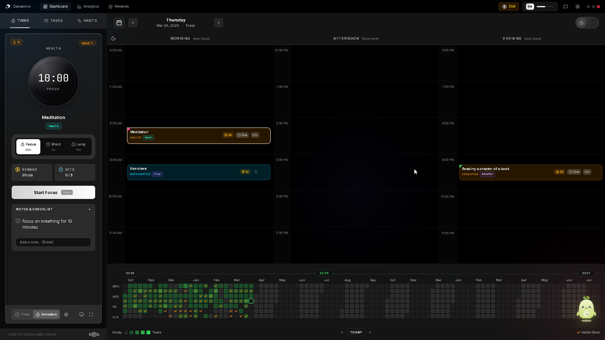
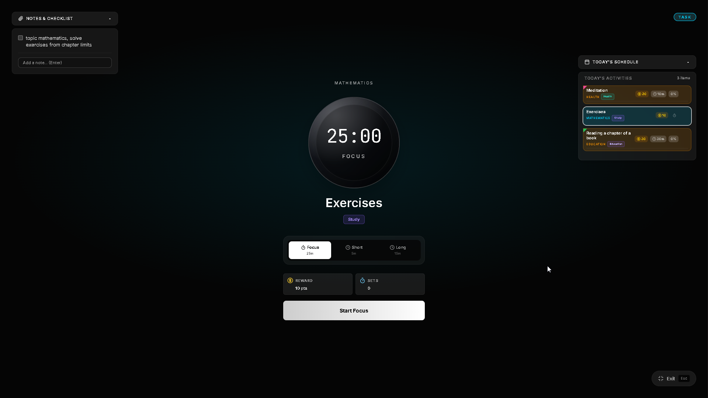
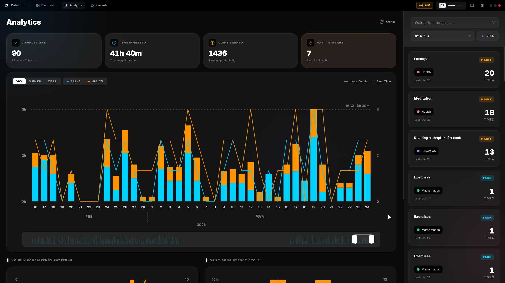
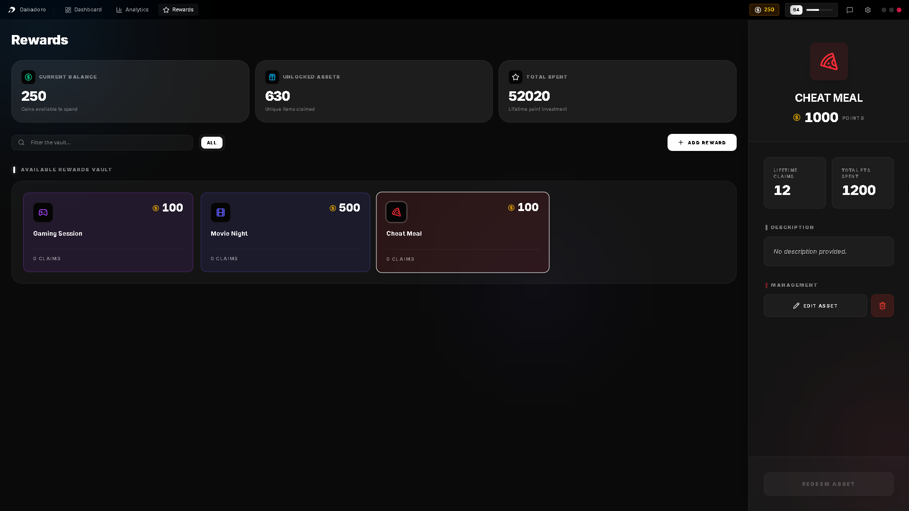

  

# Dabadoro Planner: Plan. Focus. Build habits that stick. 🎯

Dabadoro brings tasks, habits, Pomodoro focus, daily scheduling, analytics, and rewards into one stunning interface. Stop juggling five different apps and start making progress in one cohesive flow.

🌐 [**Visit the Website**](https://dabadoro.com) • 📦 [**Download Latest**](https://github.com/AChortex/dabadoro-planner/releases/latest) • 🐦 [**Twitter**](https://twitter.com/dabadoroapp)

---

  <picture>
    <source media="(prefers-color-scheme: dark)" srcset="assets/Dashboard_dark.png">
    <source media="(prefers-color-scheme: light)" srcset="assets/Dashboard_Light.png">
    
  </picture>

## 🚀 Download & Install

Dabadoro is blazingly fast, lightweight (< 6MB), and built for performance on Windows and macOS.

### 🖥️ Windows
*   **[Download .exe Installer](https://github.com/AChortex/dabadoro-planner/releases/latest)**
*   Run the installer and Dabadoro will be ready in seconds.

### 🍎 macOS (Intel & Apple Silicon)
*   **[Download .dmg](https://github.com/AChortex/dabadoro-planner/releases/latest)**
*   Open the DMG and drag Dabadoro to your Applications folder.

---

## ✨ Key Features

### 🧩 Your entire day, one calm view
See your tasks, habits, and schedule side-by-side. Drag activities into time slots, track progress through the day, and watch your heatmap fill up over weeks and months.

### ⏲️ Deep focus, beautifully timed
A stunning full-screen Pomodoro timer with your task context, notes, and checklist right beside you.

  <picture>
    <source media="(prefers-color-scheme: dark)" srcset="assets/Pomodoro_Task_Fullscreen_Dark.png">
    <source media="(prefers-color-scheme: light)" srcset="assets/Pomodoro_Habit_Fullscreen_Light.png">
    
  </picture>

### 📊 See exactly where your time goes
Beautiful analytics with daily, monthly, and yearly views. Track completions, time invested, coins earned, and habit streaks, all visualized in interactive charts.

  <picture>
    <source media="(prefers-color-scheme: dark)" srcset="assets/Analytics_Dark.png">
    <source media="(prefers-color-scheme: light)" srcset="assets/Analytics_Light.png">
    
  </picture>

### 🏆 Earn coins. Claim rewards. Stay motivated.
Every completed task and habit earns you XP and coins. Level up your profile, build your own Rewards Vault with personal treats, and redeem them when you've earned it.

  <picture>
    <source media="(prefers-color-scheme: dark)" srcset="assets/Rewards_tab_dark.png">
    <source media="(prefers-color-scheme: light)" srcset="assets/Rewards_tab_light.png">
    
  </picture>

### 🤖 10+ AI Expert Agents (AI features currently in Development)
Choose from specialist AI agents (Fitness Coach, Study Planner, Language Tutor) that generate personalized task and habit programs tailored to your goals.

---

## 🛠️ Built With
Dabadoro is built for speed and privacy:
*   **Frontend:** React + Vite
*   **System Layer:** Rust + [Tauri](https://tauri.app)
*   **Database:** Convex (Cloud Sync) + Dexie (Local-first)

---

## 🔒 Privacy & Data
Your productivity is personal. We never sell your private data (tasks, habits, or notes) to third parties. We may display relevant ads within the app to keep Dabadoro free for everyone, but your personal content stays private and secure.

---

## 📬 Support & Community
If you encounter any issues or have feature requests, please visit our [official website](https://dabadoro.com) or reach out on [Twitter](https://twitter.com/dabadoroapp).

*Dabadoro — Built with care by a solo developer who needed a calmer way to work.*
